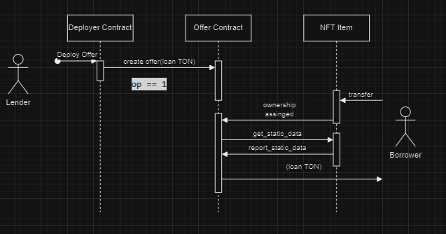
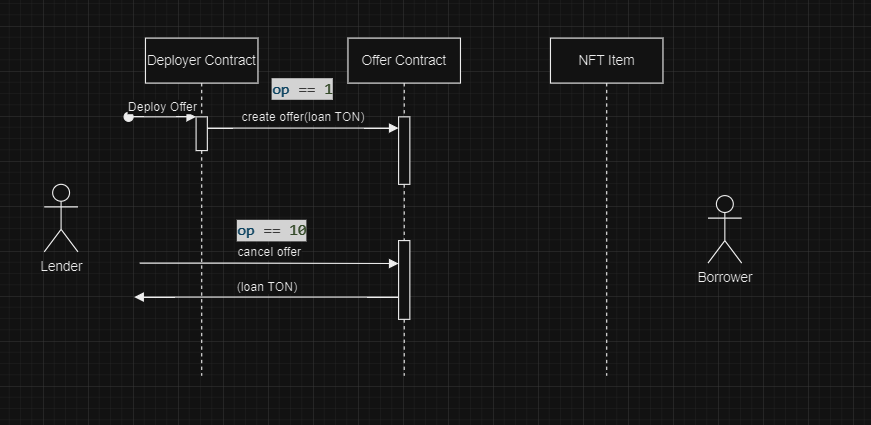
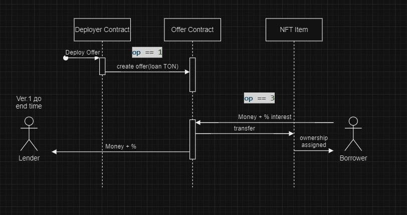
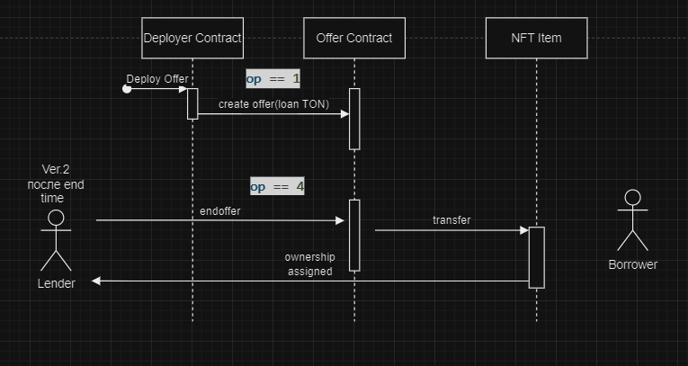

# TON NFT LOAN Protocol
## Introduction

------

If you want to support v2 development you can donate any amount of coins to this ton address ☺️

`UQBLoIcP6PdyJpi1Qo2tF14Xmb7uvhIq3mEndXkqRDBQRRP2`

> Our community [@ton_learn](./intro/intro.md) 

### What is NFT Loan Protocol
NFT Loan Protocol is a protocol where Lenders provide liquidity for collections on an orderbook. Hodlers of the NFT can instantly take out a loan, by putting up the NFT as collateral. 

### Goals of Loan Protocol

- fighting with perception then NFTs be seen as illiquid graveyards where your TON collects dust
- NFTs gain new utility through borrowing
- popular NFT collections will boost TON's ecosystem TVL

### What does NFT Loan Protocol do

Short term loans usually have high interest, so Lenders can stand to make a lot of money in a short amount of time. Borrowers may have immediate need for cash now , but nothing left in their wallet besides some shiny NFTs. We connect the Lender and Borrower, and they both get a good deal. Even in the case where the Borrower fails to pay the loan back, the Lender is still protected because the NFT is worth more than what they paid to offer the loan.

### How does NFT Loan Protocol do this?

The offers book is just where we store all the offers you can get for a loan. And when you borrow, we give you the best deal in the book. The best part is, lenders can make offers any time. This is the key to Sharky’s convenience — instant loans. So when you need cash, you always get the current best deal.

## Architecture
### Introduction

The protocol consists of two contracts - Deployer and Offer. For each NFT collection for which you want to create a borrowing mechanic, you need to create one Deployer. Deployer allows you to create an offerbook - by sending a message to the Deployer, users create offers.

### Why it looks like NFT Standart extension?

If you are familiar with the NFT and Jetton from Ton standards(TEPs), you know that TON does not imply key-value storage in smart contracts, instead it is supposed to create one master contract and thousands of item contracts. Some call this approach to smart contracts - smart contract sharding.

The problem with this approach is going beyond smart contracts: When you create any application that works with smart contracts in TON, for an adequately working frontend, you will have to create your own blockchain indexer that will collect information on a million contracts of your application.

So that the NFT Loan Protocol does not require a separate indexer, from the point of view of contract signatures, the protocol looks like an extension of the NFT standard, which means that standard indexers, like Dton, will allow you to work with it. (Standard indexers by default index the Jhetton and NFT collection standards)

## Actors
### Deployer

It is assumed that the smart contract of the Deployer deploys smart contracts of Offers for specific nft collection. Lenders create loan offers messaging deployer. For each nft collection for which you need to create a credit mechanic, you need your own separate Deployer.

### Offer

Offer contains TON for loan,and contains all the logic of credit. When an `ownership assigned` message arrives in offer, offer will check that the nft belongs to the collection and start the loan.

### NFT Collection

The nft collection contract is a standard [NFT collection](https://github.com/ton-blockchain/TEPs/blob/master/text/0062-nft-standard.md). The protocol allows the use of NFTs of a certain collection as collateral for a loan.

### NFT Item

The nft item contract is a standard [NFT Item](https://github.com/ton-blockchain/TEPs/blob/master/text/0062-nft-standard.md). The protocol allows the use of NFTs of a certain collection as collateral for a loan.

## Calls schema

### create offer - take offer

### cancel offer

### return full loan (Lender takes NFT after loan time ended)

### return nft (Borrower returns loan + interest before loan time ended)


## Calls Description
### Deployer
### op==1 - deploy offer (message ton amount become offer ton amount)
```
// message body
beginCell()
.storeUint(1, 32) // opcode (reference TODO)
.storeUint(0, 64) // queryid
.storeUint(itemIndex, 64)
.storeCoins(toNano('0')) // gas fee
.storeRef(
    beginCell().storeAddress(owner).storeRef(beginCell().endCell()) // owner of offer address
    )
    .endCell()
```
### Offer
### op == 10 cancel offer
```
// message body
beginCell()
    .storeUint(10, 32) // op
    .storeUint(0, 64) // query id
.endCell()
```
### op == 3
```
// message body
beginCell()
    .storeUint(3, 32) // op
    .storeUint(0, 64) // query id
.endCell()
```
### op == 4
```
// message body
beginCell()
    .storeUint(4, 32) // op
    .storeUint(0, 64) // query id
.endCell()
```

## c4 Register
### Deployer
|   | Type  | Comment  |
|---|---|---|
| owner_address  | Address  | deployer owner  |
| next_item_index  | int64  | index for sharding  | 
| content  | Cell  | Cell  | collection addr inside + nft_item_code for loop check |
| offer_item_code  | Cell  | offer_item_code  |
| royalty_params  | Cell | royalty_params(NFT standard typo)  |

### Offer
|   | Type  | Comment  |
|---|---|---|
| index  | int64  | index for sharding  |
| deployer_address  | Address  | Deployer address  | 
| owner_address  | Address  | Offer owner address  |
| content  | Cell  | data for loan logic  |

#### Offer 'Content'

|   | Type  | Comment  |
|---|---|---|
| nft_item_code  | Cell | from deployer needed for nft check|
| nft_collection_addr  | Address | from deployer needed for nft check | 
| royalty_params  | Cell | royalty_params(NFT standard typo)   |
| check  | int64 | op logic param |           
| full_price  | Coins | loan price |    
| prev_owner  | Address | borrower address |    
| sender_address | Address | nft address |    
|  start_loan   | int32 |loan start time |    

            
### Check Params

| Check Value | Meaning  | 
|---|---|
| 0  | offer deployed, but not yet taken   |
| 8  | NFT is checked(loop using report_static) |
| 1  | Loan started(NFT already in)  |
| 10  | Offer canceled  |
| 3  | Loan finished(money returned)  |
| 4  | Loan finished(claim NFT)  |

## V2 Backlog

- batch offer deploy
- bring parameters to deployer(ex. duration)
- normal op names
- gas optimization

## Development Assistance

TON: `UQBLoIcP6PdyJpi1Qo2tF14Xmb7uvhIq3mEndXkqRDBQRRP2`

## LICENSE

CC BY-NC-ND 4.0 https://creativecommons.org/licenses/by-nc-nd/4.0/


